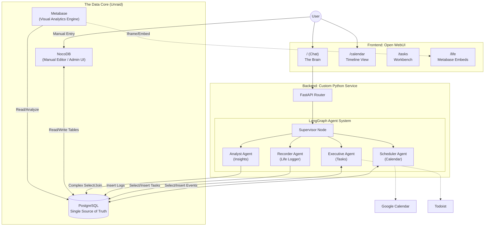

# Project: Modular AI Workspace

**Stack:** Unraid (Docker) | Open WebUI (SvelteKit) | Python (LangGraph) | PostgreSQL | NocoDB | Metabase

---
## IMPLEMENTATION REVIEW STATUS

**✅ Infrastructure (3-Pillar Stack) - VERIFIED**
- PostgreSQL: Running as single source of truth (migrations verified)
- NocoDB: Available for manual data entry (mentioned in architecture)
- Metabase: Integrated in /life page via iframe embed (+page.svelte:32-38)

**✅ Database Schema Strategy - VERIFIED**
- All planned tables exist with proper relationships
- Cross-domain joins supported (tasks ↔ events ↔ life logging)
- Migrations directory contains 12+ schema files

**✅ Frontend Integration (Open WebUI) - VERIFIED**
- /tasks page: Todoist mirror with locked subtask layout ✓
- /calendar page: Custom Svelte calendar with event display ✓
- /events page: Simple list view from backend API ✓
- /reminders page: Reminder list with priority display ✓
- /life page: Metabase dashboard iframe embed ✓

**✅ Agent System - VERIFIED**
- LangGraph multi-agent workflow (graph/workflow.py)
- Scheduler, Executive, Recorder, Analyst agents implemented
- Tools directory contains 20+ agent tools
- APScheduler for background jobs (scheduler.py)

**✅ Sync Architecture - VERIFIED**
- Todoist sync: Bidirectional with webhooks + APScheduler (every 15 min)
- Google Calendar sync: Mentioned in scheduler (disabled by default)
- Background sync pattern using FastAPI BackgroundTasks

**📊 Life Logging Tables - NOT REVIEWED**
- food_logs, menstrual_cycles, activities_sex, events_misc tables not verified during this review
- These tables may exist in migrations but were not explicitly checked

---

## 1. Executive Summary

**Vision:** A fully self-hosted, privacy-first ecosystem where a custom AI acts as the operating system for your life.

### Core Architecture:

1. **The AI agent (Logic):** A LangGraph Multi-Agent system that understands natural language and manages your data.

2. **The Vault (Storage):** A single PostgreSQL database that acts as the "Single Source of Truth" for everything—from calendar events to cycle tracking.

3. **The Admin Panel (NocoDB):** A spreadsheet-like interface for easy manual data entry and correction.

4. **The Dashboard (Metabase):** High-end business intelligence tools used to visualize personal life analytics.

---

## 2. Visual Master Scheme

This diagram illustrates the separation of concerns: Agents handle logic, NocoDB handles manual entry, and Metabase handles visualization, all centering on one database.

---

## 3. Infrastructure: The 3-Pillar Stack

These containers run on your Unraid server and communicate via a custom Docker network.

### Pillar 1: Storage (PostgreSQL)

- **Role:** The hard drive of your "Second Brain."
- **Function:** Stores all data in standard SQL tables.
- **Why:** It is universally compatible. Your Agents, NocoDB, and Metabase all speak SQL natively.

### Pillar 2: Interface (NocoDB)

- **Role:** The Data Manager (Airtable alternative).
- **Function:** Connects to Postgres to provide a friendly, spreadsheet-like UI.
- **Use Cases:**
  - Fixing a typo in a log entry without writing SQL.
  - Manually entering complex data (e.g., checking off multiple habits).
  - Creating new "random" tables on the fly (e.g., "Movie Watchlist") without needing to code.

### Pillar 3: Visualization (Metabase)

- **Role:** The Analyst.
- **Function:** Connects to Postgres to generate live charts and dashboards.
- **Use Cases:**
  - "Cycle vs. Mood" correlation graphs.
  - Spending heatmaps.
  - Weight trend lines.
- **Integration:** You design the dashboard in Metabase, then embed the public link into your Open WebUI /life page.

---

## 4. Database Schema Strategy

All tables live in the same PostgreSQL database. This allows for powerful "Cross-Domain Joins" (e.g., seeing if your Task Completion Rate drops during specific phases of your Menstrual Cycle).

### A. Life Logging Tables (Managed via Agents/NocoDB)

These are the tables replacing Ryot.

| Table Name | Key Columns | Purpose | Input Method |
|---|---|---|---|
| food_logs | item_name, source (Home/Rest.), restaurant_name, rating, photo_url | Tracking diet and dining experiences. | Agent ("I ate pizza") or NocoDB (Mobile). |
| menstrual_cycles | start_date, end_date, flow_intensity, symptoms_json | Health and cycle tracking. | Agent or NocoDB. |
| activities_sex | date, time, partner_id, protection_used, notes | Intimate health tracking. | Agent (Privacy focus) or NocoDB. |
| events_misc | category (Haircut, Dentist), cost, location, notes | Catch-all for life administration. | Agent. |

### B. Core Operational Tables

These tables drive your daily productivity.

| Table Name | Key Columns | Purpose |
|---|---|---|
| events | title, start_time, end_time, google_id | Calendar data. Syncs to Google. |
| tasks | content, due_date, priority, todoist_id | To-dos. Syncs to Todoist. |

---

## 5. Agent Workflow & Roles

Your Python backend (LangGraph) is the "Active" user of the database.

### The Recorder Agent (The Logger)

- **Role:** Listens to your day and archives it.
- **Capabilities:**
  - Natural Language to SQL: Converts "I just watched Inception and rated it 5 stars" into `INSERT INTO media_logs (title, rating) VALUES ('Inception', 5);`
  - Context Awareness: If you say "Period started today," it updates the menstrual_cycles table and recalculates prediction dates.

### The Analyst Agent (The Querier)

- **Role:** Answers specific questions using data.
- **Capabilities:**
  - Complex Joins: "How much did I spend on haircuts this year?" (Queries events_misc where category = 'Haircut').
  - Pattern Recognition: "Do I eat out more when I'm on my period?" (Correlates food_logs with menstrual_cycles).

### The Scheduler & Executive Agents

- **Role:** Management of Future Time.
- **Capabilities:**
  - Manage events and tasks tables.
  - Handle the bi-directional sync with Google/Todoist.

---

## 6. Frontend Integration (Open WebUI)

### The Life Stats Page (/life)

Instead of building complex D3.js charts from scratch in Svelte:

1. **Build in Metabase:** Create a dashboard in Metabase called "Personal Health."
2. **Embed:** Use an `<iframe>` in your Svelte page to display the Metabase dashboard.
3. **Result:** You get professional-grade, interactive charts with zero frontend coding effort.

### The Calendar Page (/calendar)

- Remains a custom Svelte + FullCalendar implementation.
- It queries the events and tasks tables directly from the API.
- It provides the interactive "Bird's Eye View" for planning.
